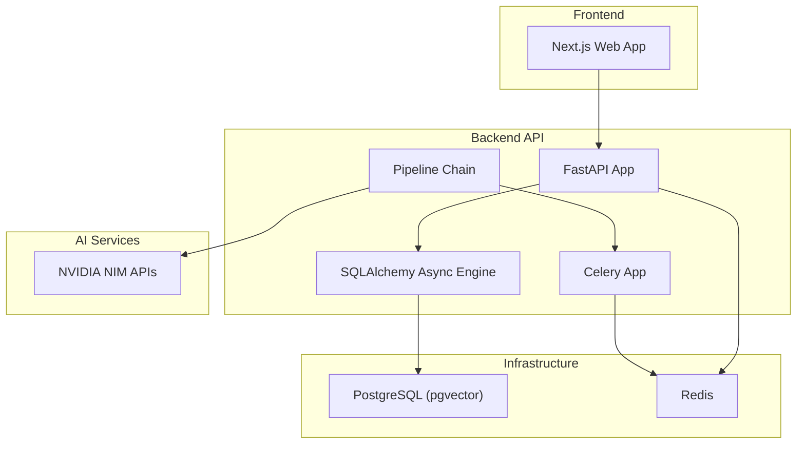
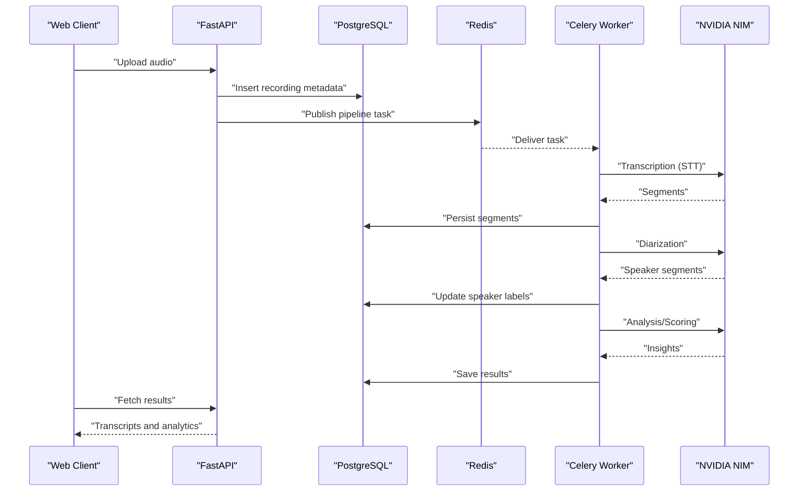
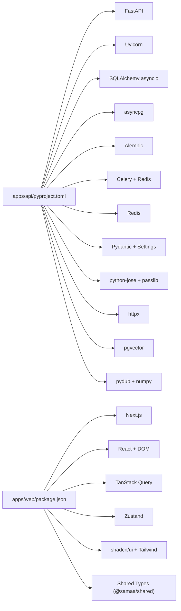

# Troubleshooting & FAQ

<cite>
**Referenced Files in This Document**
- [README.md](file://README.md)
- [docker-compose.yml](file://docker-compose.yml)
- [apps/api/pyproject.toml](file://apps/api/pyproject.toml)
- [apps/web/package.json](file://apps/web/package.json)
- [apps/api/src/config.py](file://apps/api/src/config.py)
- [apps/api/src/main.py](file://apps/api/src/main.py)
- [apps/api/src/database.py](file://apps/api/src/database.py)
- [apps/api/src/api/v1/auth.py](file://apps/api/src/api/v1/auth.py)
- [apps/api/src/services/auth.py](file://apps/api/src/services/auth.py)
- [apps/api/src/storage/local.py](file://apps/api/src/storage/local.py)
- [apps/api/src/ai/nvidia_client.py](file://apps/api/src/ai/nvidia_client.py)
- [apps/api/src/workers/celery_app.py](file://apps/api/src/workers/celery_app.py)
- [apps/api/src/workers/pipeline.py](file://apps/api/src/workers/pipeline.py)
- [apps/api/src/workers/transcription.py](file://apps/api/src/workers/transcription.py)
- [apps/api/src/workers/diarization.py](file://apps/api/src/workers/diarization.py)
</cite>

## Table of Contents
1. [Introduction](#introduction)
2. [Project Structure](#project-structure)
3. [Core Components](#core-components)
4. [Architecture Overview](#architecture-overview)
5. [Detailed Component Analysis](#detailed-component-analysis)
6. [Dependency Analysis](#dependency-analysis)
7. [Performance Considerations](#performance-considerations)
8. [Troubleshooting Guide](#troubleshooting-guide)
9. [Conclusion](#conclusion)
10. [Appendices](#appendices)

## Introduction
This document provides a comprehensive troubleshooting and FAQ guide for the Xsamaa AI Pipeline. It focuses on diagnosing and resolving issues across AI service integrations (NVIDIA NIM), database connectivity and migrations, frontend build/runtime, Celery worker startup and task processing, audio processing pipeline bottlenecks, and authentication. It also covers systematic debugging approaches, log analysis techniques, diagnostic commands, performance tuning, scaling, environment-specific pitfalls, dependency/version conflicts, and network connectivity issues.

## Project Structure
The system comprises:
- Backend API (FastAPI) with Celery workers for asynchronous audio processing
- PostgreSQL with pgvector and Redis for persistence and task queue
- Next.js frontend (React) dashboard
- Shared TypeScript types
- Monorepo managed by Turborepo and npm workspaces

**Diagram sources**
- [apps/api/src/main.py:1-29](file://apps/api/src/main.py#L1-L29)
- [apps/api/src/database.py:1-34](file://apps/api/src/database.py#L1-L34)
- [apps/api/src/workers/celery_app.py:1-31](file://apps/api/src/workers/celery_app.py#L1-L31)
- [apps/api/src/workers/pipeline.py:1-35](file://apps/api/src/workers/pipeline.py#L1-L35)
- [apps/api/src/ai/nvidia_client.py:1-274](file://apps/api/src/ai/nvidia_client.py#L1-L274)
- [docker-compose.yml:1-35](file://docker-compose.yml#L1-L35)

**Section sources**
- [README.md:10-308](file://README.md#L10-L308)

## Core Components
- Configuration and environment variables: centralized via pydantic-settings with defaults and overrides from .env
- Database: async SQLAlchemy engine with connection pooling tuned for concurrency
- Authentication: JWT-based login/refresh/logout with bcrypt password hashing
- Storage: local filesystem backend with sync/async methods; factory selection based on configuration
- AI integration: NVIDIA NIM client with retry/backoff, timeouts, and error categorization
- Task pipeline: Celery chain orchestrating preprocessing, transcription, diarization, segmentation, analysis, and scoring
- Frontend: Next.js app consuming the backend API via environment-provided API URL

**Section sources**
- [apps/api/src/config.py:1-52](file://apps/api/src/config.py#L1-L52)
- [apps/api/src/database.py:1-34](file://apps/api/src/database.py#L1-L34)
- [apps/api/src/api/v1/auth.py:1-82](file://apps/api/src/api/v1/auth.py#L1-L82)
- [apps/api/src/services/auth.py:1-55](file://apps/api/src/services/auth.py#L1-L55)
- [apps/api/src/storage/local.py:1-50](file://apps/api/src/storage/local.py#L1-L50)
- [apps/api/src/ai/nvidia_client.py:1-274](file://apps/api/src/ai/nvidia_client.py#L1-L274)
- [apps/api/src/workers/celery_app.py:1-31](file://apps/api/src/workers/celery_app.py#L1-L31)
- [apps/api/src/workers/pipeline.py:1-35](file://apps/api/src/workers/pipeline.py#L1-L35)
- [apps/web/package.json:1-38](file://apps/web/package.json#L1-L38)

## Architecture Overview
End-to-end flow from upload to insights:
- Upload audio via frontend → API routes persist metadata and trigger Celery pipeline
- Celery workers process audio asynchronously: preprocessing → STT → diarization → segmentation → analysis → scoring
- Results stored in PostgreSQL; embeddings powered by NVIDIA NIM embeddings endpoint
- Frontend fetches processed transcripts and analytics

**Diagram sources**
- [apps/api/src/workers/pipeline.py:1-35](file://apps/api/src/workers/pipeline.py#L1-L35)
- [apps/api/src/workers/transcription.py:1-146](file://apps/api/src/workers/transcription.py#L1-L146)
- [apps/api/src/workers/diarization.py:1-119](file://apps/api/src/workers/diarization.py#L1-L119)
- [apps/api/src/ai/nvidia_client.py:1-274](file://apps/api/src/ai/nvidia_client.py#L1-L274)
- [apps/api/src/database.py:1-34](file://apps/api/src/database.py#L1-L34)

## Detailed Component Analysis

### AI Service Integration (NVIDIA NIM)
Common issues:
- Authentication failures (invalid/expired API key)
- Rate limiting from NVIDIA NIM
- Network timeouts or connection errors
- Large audio file uploads exceeding API limits

Diagnostic steps:
- Verify environment variables for NVIDIA API key and base URL
- Confirm endpoint reachability and model availability
- Inspect retry/backoff behavior and logs for transient errors
- Validate chunking logic for large audio files

Key implementation references:
- Client initialization, headers, timeouts, and retry policy
- Error categorization (auth, rate limit, generic API errors)
- Chat completions and embeddings endpoints
- Multipart uploads for audio files

**Section sources**
- [apps/api/src/config.py:28-36](file://apps/api/src/config.py#L28-L36)
- [apps/api/src/ai/nvidia_client.py:32-197](file://apps/api/src/ai/nvidia_client.py#L32-L197)
- [apps/api/src/ai/nvidia_client.py:200-274](file://apps/api/src/ai/nvidia_client.py#L200-L274)

### Database Connectivity and Migrations
Common issues:
- Connection refused or invalid credentials
- Migration failures or unapplied revisions
- Pool exhaustion under load

Diagnostic steps:
- Check DATABASE_URL and credentials
- Verify PostgreSQL health and port mapping
- Run Alembic upgrade/downgrade commands
- Monitor pool size and overflow settings

Key implementation references:
- Async engine creation with pool settings
- Session lifecycle and transaction handling
- Alembic configuration and commands

**Section sources**
- [apps/api/src/config.py:11-14](file://apps/api/src/config.py#L11-L14)
- [apps/api/src/database.py:8-19](file://apps/api/src/database.py#L8-L19)
- [apps/api/src/database.py:26-34](file://apps/api/src/database.py#L26-L34)
- [README.md:206-221](file://README.md#L206-L221)

### Frontend Build and Runtime Errors
Common issues:
- Missing NEXT_PUBLIC_API_URL
- Port conflicts or proxy misconfiguration
- Dependency mismatch between Next.js and shared packages

Diagnostic steps:
- Confirm .env.local includes NEXT_PUBLIC_API_URL
- Validate port availability and CORS settings
- Reinstall dependencies and rebuild

Key implementation references:
- Next.js dependencies and scripts
- Environment variable consumption by frontend

**Section sources**
- [README.md:70-74](file://README.md#L70-L74)
- [apps/web/package.json:1-38](file://apps/web/package.json#L1-L38)

### Celery Worker Startup and Task Processing Failures
Common issues:
- Broker unreachable (Redis)
- Serialization or task decoding errors
- Long-running tasks timing out
- Prefetch and concurrency misconfiguration

Diagnostic steps:
- Verify REDIS_URL and Redis health
- Check task serialization and content types
- Review soft/hard time limits and prefetch multiplier
- Inspect worker logs for retry behavior

Key implementation references:
- Celery app configuration and included tasks
- Pipeline chain composition
- Task-level retry and status updates

**Section sources**
- [apps/api/src/config.py:15-16](file://apps/api/src/config.py#L15-L16)
- [apps/api/src/workers/celery_app.py:5-31](file://apps/api/src/workers/celery_app.py#L5-L31)
- [apps/api/src/workers/pipeline.py:12-35](file://apps/api/src/workers/pipeline.py#L12-L35)

### Audio Processing Pipeline Bottlenecks
Common issues:
- Large audio files causing timeouts or memory spikes
- Inefficient chunking or re-encoding
- Missing speaker labels affecting downstream analysis

Diagnostic steps:
- Monitor task durations and logs for chunking decisions
- Validate audio preprocessing steps and file sizes
- Ensure speaker labels are propagated to transcript segments

Key implementation references:
- Transcription task with chunking logic
- Diarization merging and speaker label updates
- Preprocessing and storage interactions

**Section sources**
- [apps/api/src/workers/transcription.py:53-146](file://apps/api/src/workers/transcription.py#L53-L146)
- [apps/api/src/workers/diarization.py:65-119](file://apps/api/src/workers/diarization.py#L65-L119)

### Authentication System Problems
Common issues:
- Invalid credentials or inactive users
- JWT signature or expiration mismatches
- Token refresh failures

Diagnostic steps:
- Verify user exists and password hash matches
- Check JWT secret, algorithm, and expiry settings
- Validate token decoding and refresh flow

Key implementation references:
- Login, refresh, and logout endpoints
- Password hashing and verification
- JWT encode/decode and token payloads

**Section sources**
- [apps/api/src/api/v1/auth.py:24-82](file://apps/api/src/api/v1/auth.py#L24-L82)
- [apps/api/src/services/auth.py:14-55](file://apps/api/src/services/auth.py#L14-L55)
- [apps/api/src/config.py:18-23](file://apps/api/src/config.py#L18-L23)

## Dependency Analysis
Runtime and development dependencies are declared per service. Ensure consistent versions across environments and avoid mixing system Python with project-managed environments.

**Diagram sources**
- [apps/api/pyproject.toml:1-43](file://apps/api/pyproject.toml#L1-L43)
- [apps/web/package.json:1-38](file://apps/web/package.json#L1-L38)

**Section sources**
- [apps/api/pyproject.toml:1-43](file://apps/api/pyproject.toml#L1-L43)
- [apps/web/package.json:1-38](file://apps/web/package.json#L1-L38)

## Performance Considerations
- Slow API responses
  - Enable SQL echo only in controlled environments to inspect queries
  - Tune database pool size and overflow based on concurrent requests
  - Profile endpoints and middleware overhead
- Memory usage for large audio files
  - Use chunked transcription for files larger than typical API limits
  - Prefer streaming I/O and avoid loading entire files into memory unnecessarily
- Scaling in production
  - Increase Celery worker concurrency and scale horizontally
  - Use dedicated Redis for queues and results
  - Scale PostgreSQL with read replicas if read-heavy dashboards are introduced
- Embeddings and vector similarity
  - Batch embedding requests and cache results when appropriate
  - Use pgvector efficiently with proper indexing strategies

[No sources needed since this section provides general guidance]

## Troubleshooting Guide

### AI Service Integration (NVIDIA NIM)
Symptoms:
- Authentication failures during STT/diarization/LLM/embeddings
- Rate limit errors causing retries
- Timeouts or connection errors for large audio uploads

Actions:
- Confirm NVIDIA API key and base URL in environment
- Check network connectivity and DNS resolution
- Review retry/backoff logs and adjust timeout if needed
- For large audio, ensure chunking logic is triggered and audio is properly segmented

Logs and diagnostics:
- Inspect task logs for NIM API errors and retry attempts
- Validate multipart uploads and file seek behavior on retries

**Section sources**
- [apps/api/src/config.py:28-36](file://apps/api/src/config.py#L28-L36)
- [apps/api/src/ai/nvidia_client.py:48-72](file://apps/api/src/ai/nvidia_client.py#L48-L72)
- [apps/api/src/ai/nvidia_client.py:97-131](file://apps/api/src/ai/nvidia_client.py#L97-L131)
- [apps/api/src/ai/nvidia_client.py:158-197](file://apps/api/src/ai/nvidia_client.py#L158-L197)
- [apps/api/src/workers/transcription.py:78-85](file://apps/api/src/workers/transcription.py#L78-L85)

### Database Connection Failures and Migration Issues
Symptoms:
- Connection refused or invalid credentials
- Alembic upgrade fails or migrations stuck

Actions:
- Verify DATABASE_URL and credentials
- Ensure PostgreSQL is healthy and accepting connections
- Run Alembic upgrade/downgrade commands explicitly
- Check for conflicting migrations and resolve manually if needed

Logs and diagnostics:
- Enable SQL echo temporarily to inspect queries
- Inspect pool size and overflow under load

**Section sources**
- [apps/api/src/config.py:11-14](file://apps/api/src/config.py#L11-L14)
- [apps/api/src/database.py:8-19](file://apps/api/src/database.py#L8-L19)
- [README.md:206-221](file://README.md#L206-L221)

### Frontend Build and Runtime Errors
Symptoms:
- Build fails due to missing environment variables
- Runtime errors accessing API endpoints

Actions:
- Ensure NEXT_PUBLIC_API_URL is present in .env.local
- Reinstall dependencies and rebuild the project
- Verify port availability and CORS origins

Logs and diagnostics:
- Check browser console for network errors
- Confirm API base URL resolves to the running backend

**Section sources**
- [README.md:70-74](file://README.md#L70-L74)
- [apps/web/package.json:1-38](file://apps/web/package.json#L1-L38)

### Celery Worker Startup and Task Processing Failures
Symptoms:
- Worker does not start or exits immediately
- Tasks fail with serialization or timeout errors

Actions:
- Confirm REDIS_URL and Redis health
- Check Celery configuration for serialization and time limits
- Increase worker concurrency and monitor prefetch settings
- Inspect task logs for retry behavior and exceptions

Logs and diagnostics:
- Review Celery worker logs for startup and task execution
- Validate task routing and included task modules

**Section sources**
- [apps/api/src/config.py:15-16](file://apps/api/src/config.py#L15-L16)
- [apps/api/src/workers/celery_app.py:19-31](file://apps/api/src/workers/celery_app.py#L19-L31)
- [apps/api/src/workers/pipeline.py:12-35](file://apps/api/src/workers/pipeline.py#L12-L35)

### Audio Processing Pipeline Bottlenecks
Symptoms:
- Transcription or diarization tasks taking too long
- Missing speaker labels or corrupted segments

Actions:
- Enable chunked transcription for large files
- Validate audio preprocessing and storage paths
- Ensure speaker label updates are applied after diarization

Logs and diagnostics:
- Monitor task durations and chunk boundaries
- Verify segment counts and speaker distributions

**Section sources**
- [apps/api/src/workers/transcription.py:78-85](file://apps/api/src/workers/transcription.py#L78-L85)
- [apps/api/src/workers/transcription.py:104-146](file://apps/api/src/workers/transcription.py#L104-L146)
- [apps/api/src/workers/diarization.py:92-110](file://apps/api/src/workers/diarization.py#L92-L110)

### Authentication System Problems
Symptoms:
- Login fails with invalid credentials
- Token refresh returns unauthorized

Actions:
- Verify user exists and password hash matches
- Check JWT secret, algorithm, and expiry settings
- Ensure refresh tokens are not expired

Logs and diagnostics:
- Inspect authentication endpoints and token payloads
- Validate JWT decoding and error responses

**Section sources**
- [apps/api/src/api/v1/auth.py:24-82](file://apps/api/src/api/v1/auth.py#L24-L82)
- [apps/api/src/services/auth.py:14-55](file://apps/api/src/services/auth.py#L14-L55)
- [apps/api/src/config.py:18-23](file://apps/api/src/config.py#L18-L23)

### Environment-Specific Problems and Resolutions
- Docker Compose services health checks
  - PostgreSQL and Redis health checks ensure readiness
- Environment variables
  - Root .env must be symlinked for API to read
  - Frontend requires NEXT_PUBLIC_API_URL in .env.local

Actions:
- Start infrastructure with Docker Compose and wait for health checks
- Symlink .env into apps/api and restart services
- Set frontend API URL and rebuild

**Section sources**
- [docker-compose.yml:13-17](file://docker-compose.yml#L13-L17)
- [docker-compose.yml:26-30](file://docker-compose.yml#L26-L30)
- [README.md:52-98](file://README.md#L52-L98)
- [README.md:70-74](file://README.md#L70-L74)

### Dependency Conflicts and Version Mismatches
- Backend Python version and dependencies
  - Requires Python >= 3.12 and pinned versions
- Frontend Node.js and package versions
  - Requires Node.js >= 20 and Next.js 16

Actions:
- Use uv to manage Python virtual environments
- Use npm to manage Node.js dependencies
- Keep versions aligned with pyproject.toml and package.json

**Section sources**
- [README.md:28-38](file://README.md#L28-L38)
- [apps/api/pyproject.toml:1-43](file://apps/api/pyproject.toml#L1-L43)
- [apps/web/package.json:1-38](file://apps/web/package.json#L1-L38)

### Network Connectivity Issues
- NVIDIA NIM endpoints
  - Ensure outbound HTTPS access and model availability
- Redis connectivity
  - Validate REDIS_URL and firewall rules
- CORS and frontend-backend communication
  - Confirm allowed origins and credentials

Actions:
- Test connectivity to NVIDIA endpoints
- Verify Redis ping and network accessibility
- Adjust CORS origins and credentials as needed

**Section sources**
- [apps/api/src/config.py:30-44](file://apps/api/src/config.py#L30-L44)
- [apps/api/src/main.py:15-21](file://apps/api/src/main.py#L15-L21)
- [docker-compose.yml:19-30](file://docker-compose.yml#L19-L30)

## Conclusion
This guide consolidates practical troubleshooting steps, diagnostic commands, and configuration checks for the Xsamaa AI Pipeline. By validating environment variables, infrastructure health, dependency versions, and component-specific logs, most issues can be resolved systematically. For production scaling, focus on worker concurrency, database pooling, and efficient audio chunking strategies.

[No sources needed since this section summarizes without analyzing specific files]

## Appendices

### Frequently Asked Questions (FAQ)
- What are the system requirements?
  - Python >= 3.12, Node.js >= 20, Docker/Docker Compose v2+, ffmpeg, uv
- Which audio formats are supported?
  - WAV is used internally; ensure uploaded audio is convertible to WAV via pydub
- Are there processing limitations for audio files?
  - Large files are chunked for STT; ensure sufficient disk space and memory
- How do I integrate additional AI services?
  - Extend the AI client abstractions and update pipeline tasks accordingly
- How do I configure S3-compatible storage?
  - Set STORAGE_BACKEND=s3 and provide AWS credentials and bucket details

**Section sources**
- [README.md:28-38](file://README.md#L28-L38)
- [README.md:234-248](file://README.md#L234-L248)
- [apps/api/src/storage/local.py:44-50](file://apps/api/src/storage/local.py#L44-L50)
- [apps/api/src/workers/transcription.py:78-85](file://apps/api/src/workers/transcription.py#L78-L85)